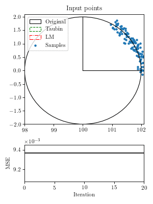
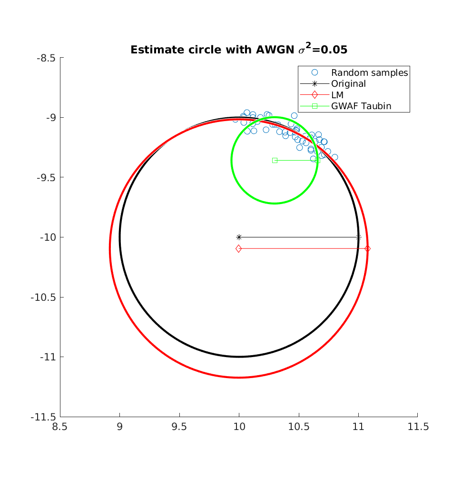

# circle_fit
**circle_fit** is a least-squares circle fitting library written in C++.

## Examples
There is also a _Python_ and _MATLAB_ binding.
The example below was generated with _Python_ and _Matplotlib_.
See `src/python/example_animation.py`.



Here is an example plotted from MATLAB.
The corresponding code is in `src/matlab/example.m`.

.

## Build instructions
Build requirements are a C++14 compiler, _cmake_ and _Python3_ for code generation.
```
git clone git@github.com:RobMa/circle_fit.git
cd circle_fit
mkdir build && cd build && cmake .. && cd ..
cmake --build build
```
The library depends on _Eigen3_, _spdlog_ and _Catch2_.
_cmake_ will download the dependencies automatically and store the in the `extern` folder.

### MATLAB MEX build instructions
The circle_fit functions can be called directly from _MATLAB_, if the mex files are in the MATLAB path.
To build the mex-files set the _cmake_ flag `BUILD_MEX`:
```
cd build
cmake .. -DBUILD_MEX=ON
cd ..
cmake --build build
```
Then add the `build` folder to the MATLAB path.
